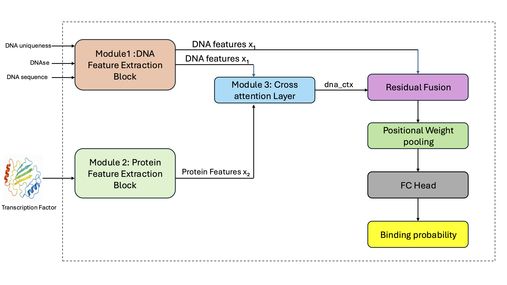

# TransBind-2

## Table of Contents
- [Overview](#overview)
- [Model Architecture](#model-architecture)
- [Installation](#installation)
  - [Requirements](#requirements)
- [Data Preprocessing Pipeline](#data-preprocessing-pipeline)
  - [Protein Features](#protein-features)
- [Training and Testing](#training-and-testing)
  - [Training Data Preparation](#training-data-preparation)
  - [Training Dataset](#training-dataset)
  - [Training](#training)
  - [Testing](#testing)
  - [Prediction](#prediction)
- [Citation](#citation)

## Overview

TransBind-2 is a deep learning framework for predicting transcription factor (TF)–DNA binding by integrating DNA sequence with the biological context surrounding potential binding sites. Building on our previous TransBind model, TransBind-2 incorporates DNase-seq chromatin accessibility and genome mappability alongside DNA sequence information. To capture TF-specific features, the model uses ProstT5 to encode both the amino acid sequence and 3D structural information of each TF. These DNA and protein representations are connected through bidirectional cross-attention, allowing information from each modality to inform the other and providing a more complete representation of TF–DNA interactions.

TransBind-2 formulates binding prediction as a binary classification task for individual DNA bin–TF–cell type combinations. This design enables the model to learn relationships across TFs and cellular contexts and, importantly, to make predictions for TFs and cell types that were not encountered during training. We trained the model on 690 ChIP-seq experiments covering 161 TFs and 91 human cell types. TransBind-2 achieved a macro AUROC of 0.9648 and an AUPR of 0.4215, representing a 12.67% relative improvement in AUPR over the original TransBind model and other baseline approaches. The model also showed strong transferability beyond human data, successfully performing zero-shot TF–DNA binding prediction on mouse datasets.

Together, these results suggest that incorporating TF structural features and chromatin context can substantially improve both the accuracy and generalizability of TF–DNA binding prediction. By capturing information from the TF, DNA sequence, and local chromatin environment within a unified framework, TransBind-2 provides a useful approach for investigating gene regulation, interpreting the regulatory effects of disease-associated variants, and supporting applications in synthetic biology.


## Model Architecture


*Figure 1: TransBind2 model architecture for transcription factor binding site prediction*

## Installation

### Requirements
- PyTorch + PyTorch Lightning
- NumPy, scikit-learn, h5py
- CUDA recommended

### Quick Install
```bash
git clone https://github.com/jianlin-cheng/TransBind2.git
cd TransBind2
conda env create -f environment.yml
conda activate transBind
```

# Data Preprocessing Pipeline

| Step | Script | Description |
|---|---|---|
| 1 | `0_download_data.py` | Download human genome assembly and Transcription Factor Binding Sites |
| 2 | `1_preprocess_narrowPeaks_and_humanGenome.sh` | Preprocess human genome assembly and TF binding sites |
| 3 | `2_compute_overlapping_using_batch.sh`<br>`3_postprocess.sh`<br>`4_merge_peaks_with_same_labels.ipynb` | Find overlapping regions and assign labels |
| 4 | `5_build_bedFile.py`<br>`5.1_convert_metadata.py` | Convert processed data to individual BED files |
| 5 | `6_build_dataset.py`<br>`6.1_extract_labelname.py`<br>`6.2_creating_label_name_merged` | Build final dataset → saves to data/ directory and extract label names<br>Extract feature names from metadata → saves label_name.txt<br>Merge label_name.txt with TF/Cell Type mapping → saves label_file_final_merged.csv |
| 6 | `7_data_conversion_to_binaryV1` | Convert .mat files to binary long-format dataset → saves {split}_unique_dna.npz, standalone_{split}_indices.npz |
| 7 | `8_mapping_between_filename_TF.ipynb` | Create mapping between features and transcription factors |
| 8 | `9_label_mapping_between_label_and_TF.py` | Create comprehensive mapping between labels and TFs |

## Transcription Factor

| Step | Script | Description |
|---|---|---|
| 1 | `1_download_fasta_from_uniprot.py` | Download amino-acid FASTA sequences from UniProt for each TF → saves to Protein_data/fasta/ |
| 2 | `2_get_pdb_from_AF.py` | Download predicted protein structures (PDB) from AlphaFold for each FASTA → saves to Protein_data/AF_structure/ |
| 3 | `3_PDB_to_3Di.sh` | Convert PDB structures to 3Di structural tokens using Foldseek → saves to Protein_data/3Di_tokens/ |
| 4 | `4_generate_prostt5_embedding.py` | Generate ProstT5 dual-track (sequence + structure) embeddings per protein → saves to Protein_data/prostt5_featuresV1/ |

## DNase Data

| Step | Script | Description |
|---|---|---|
| 1 | `0_download_md5.sh` | Download DNase Uniform peaks from UCSC/ENCODE (wgEncodeAwgDnaseUniform), with md5 verification |
| 2 | `1_convert_to_bw.sh` | Convert .narrowPeak.gz → .bedGraph → .bw per cell type via bedtools merge / bedClip / bedGraphToBigWig |
| 3 | `2_extract_dnase_parallel.py` | Extract per-window DNase signal from .bw files at each {split}_coords.csv coordinate, in parallel across cell types |
| 4 | `3_normalise_dnase.py` | Apply log1p + global z-score normalization + clipping ([-5, 5]) to all DNase signal files |
| 5 | `4_convert_dnase_to_hdf5.py` | Consolidate per-cell-type normalized .npy files into {split}_dnase.h5, quantized to uint8; missing cell types auto-filled with a fixed no-coverage default |

## Uniqueness Data

| Step | Script | Description |
|---|---|---|
| 1 | `1_extract_uniqueness_score` | Extract mean uniqueness score per genomic window from the Duke uniqueness bigWig track, using the same {split}_coords.csv coordinates as DNase extraction → saves {split}_uniqueness.npy |

### Training Data Preparation

Before training the model, complete the following steps:

| Step | Process | Description |
|------|---------|-------------|
| 1️ | Data preprocessing | Complete steps 1–8 from the preprocessing pipeline described above, plus the DNase, uniqueness, and protein feature pipelines |
| 2 | Dataset organization | Ensure `train_unique_dna.npz`, `standalone_train_indices.npz` (and val/test equivalents) are stored in `data/Binary_dataV1/` |
| 3 | DNase data | Ensure `train_dnase.h5` and `val_dnase.h5` exist in `data/Binary_dataV1/`  |
| 4 | Uniqueness data | Ensure `train_uniqueness.npy` and `val_uniqueness.npy` exist in `uniqueness_processed/` |
| 5 | Feature mapping | Verify `tf_mapping_with_features_with_graphsV1.csv` exists in `data/Binary_dataV1/Binary_data_for_TF_splitV3/EGNN/` (links TF labels to protein features) |
| 6 | Protein features | Verify `Protein_data/prostt5_featuresV1/` contains the `.fea` embedding files referenced by the TF mapping |

---

### Training Dataset

